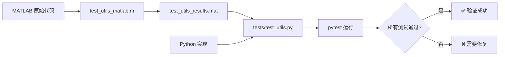

# NSCT Toolbox - 测试文件组织结构

## 📂 完整项目结构

```
nsct_toolbox/
│
├── 📁 nsct_python/                 # Python 实现包
│   ├── __init__.py
│   ├── core.py                     # 核心 NSCT 变换函数
│   ├── filters.py                  # 滤波器生成函数
│   └── utils.py                    # 工具函数 ✅ 已完成测试
│
├── 📁 tests/                       # pytest 测试套件
│   ├── __init__.py
│   ├── test_utils.py               # utils.py 测试 (19 tests ✅)
│   └── README.md                   # 测试说明文档
│
├── 📁 .venv/                       # Python 虚拟环境
│
├── 📝 MATLAB 测试文件
│   ├── test_utils_matlab.m         # MATLAB 测试脚本（生成参考数据）
│   └── test_utils_results.mat      # MATLAB 参考输出数据
│
├── 📝 测试文档
│   ├── TESTING_GUIDE.md            # 完整测试指南（本文件的上级）
│   ├── TEST_SUMMARY.md             # 详细测试报告
│   └── tests/README.md             # 测试目录说明
│
├── 🔧 快速测试脚本
│   ├── run_tests.bat               # Windows 自动化测试脚本
│   └── run_tests.sh                # Linux/Mac 自动化测试脚本
│
├── ⚙️ 配置文件
│   ├── pyproject.toml              # pytest 配置 + Python 项目配置
│   ├── requirements.txt            # Python 依赖
│   └── .gitignore                  # Git 忽略规则
│
└── 📄 MATLAB 原始实现 (参考)
    ├── extend2.m                   # 2D 扩展
    ├── upsample2df.m               # 2D 滤波器上采样
    ├── modulate2.m                 # 2D 调制
    ├── resampz.m                   # 矩阵重采样
    ├── qupz.m                      # Quincunx 上采样
    ├── nsctdec.m                   # NSCT 分解
    ├── nsctrec.m                   # NSCT 重构
    ├── nsdfbdec.m                  # 非下采样方向滤波器组分解
    ├── nsdfbrec.m                  # 非下采样方向滤波器组重构
    ├── nsfbdec.m                   # 非下采样滤波器组分解
    ├── nsfbrec.m                   # 非下采样滤波器组重构
    ├── atrousdec.m                 # À trous 算法分解
    ├── atrousrec.m                 # À trous 算法重构
    └── ... (其他 MATLAB 文件)
```

## 📊 测试文件详细说明

### 1. Python 测试文件

#### `tests/test_utils.py`
**功能**: 测试 `nsct_python/utils.py` 中的所有函数  
**测试数**: 19  
**状态**: ✅ 全部通过  

**测试类组织**:
```python
class TestExtend2          # 4 个测试
class TestUpsample2df      # 2 个测试  
class TestModulate2        # 4 个测试
class TestResampz          # 5 个测试
class TestQupz             # 4 个测试
```

**运行方式**:
```bash
pytest tests/test_utils.py -v
```

### 2. MATLAB 测试文件

#### `test_utils_matlab.m`
**功能**: 生成所有测试用例的 MATLAB 参考输出  
**输出**: `test_utils_results.mat`  
**测试数**: 19  

**运行方式**:
```bash
matlab -batch "run('test_utils_matlab.m')"
```

**生成的数据结构**:
```matlab
test_results
├── test1   (extend2 - periodic basic)
├── test2   (extend2 - periodic small)
├── test3   (extend2 - qper_row)
├── test4   (extend2 - qper_col)
├── test5   (upsample2df - power 1)
├── test6   (upsample2df - power 2)
├── test7   (modulate2 - row)
├── test8   (modulate2 - column)
├── test9   (modulate2 - both)
├── test10  (modulate2 - both with center)
├── test11  (resampz - type 1)
├── test12  (resampz - type 2)
├── test13  (resampz - type 3)
├── test14  (resampz - type 4)
├── test15  (resampz - type 1 shift 2)
├── test16  (qupz - type 1 small)
├── test17  (qupz - type 2 small)
├── test18  (qupz - type 1 large)
└── test19  (qupz - type 2 large)
```

### 3. 文档文件

#### `TESTING_GUIDE.md`
**内容**:
- 📖 完整的测试指南
- 🚀 快速开始步骤
- 🔧 依赖安装说明
- 📊 测试覆盖详情
- 🐛 故障排除
- 📝 如何添加新测试

#### `TEST_SUMMARY.md`
**内容**:
- ✅ 测试结果概览
- 📋 详细测试报告（表格形式）
- 🔧 测试方法说明
- 📊 代码一致性分析
- 🎯 关键发现
- 📝 实现注意事项

#### `tests/README.md`
**内容**:
- 测试套件说明
- 运行步骤
- 测试覆盖的函数列表
- 测试原理
- 故障排除

### 4. 自动化脚本

#### `run_tests.bat` (Windows)
```batch
# 自动执行:
1. 运行 MATLAB 生成参考数据
2. 运行 Python 测试
3. 显示结果
```

#### `run_tests.sh` (Linux/Mac)
```bash
# 自动执行:
1. 运行 MATLAB 生成参考数据
2. 运行 Python 测试
3. 显示结果
```

## 🎯 测试工作流程



## 📈 测试覆盖进度

| 模块 | 函数数 | 测试文件 | 测试数 | 状态 |
|------|--------|----------|--------|------|
| utils.py | 5 | test_utils.py | 19 | ✅ 100% |
| filters.py | ~8 | - | 0 | ⏳ 待完成 |
| core.py | ~4 | - | 0 | ⏳ 待完成 |
| **总计** | **~17** | **1** | **19** | **~35%** |

## 🔍 测试数据文件

### `test_utils_results.mat`

**文件大小**: ~50 KB  
**格式**: MATLAB MAT 文件 (v7.3)  
**包含**: 19 个测试用例的输入和输出  

**使用示例** (Python):
```python
from scipy.io import loadmat

# 加载数据
data = loadmat('test_utils_results.mat')
test_results = data['test_results'][0, 0]

# 访问特定测试
test1 = test_results['test1'][0, 0]
input_mat = test1['input']
output_mat = test1['output']
```

**使用示例** (MATLAB):
```matlab
% 加载数据
load('test_utils_results.mat');

% 访问特定测试
input_mat = test_results.test1.input;
output_mat = test_results.test1.output;
```

## 🔐 版本控制

### Git 忽略规则 (`.gitignore`)

```gitignore
# Python
__pycache__/
*.py[cod]
.venv/
.pytest_cache/

# MATLAB
*.asv
*.mat        # 可选：如果 .mat 文件较大

# IDE
.vscode/
.idea/
```

**建议**:
- ✅ 提交: 测试代码、文档、脚本
- ❓ 可选: `test_utils_results.mat` (可由脚本重新生成)
- ❌ 忽略: 虚拟环境、缓存文件、IDE 配置

## 📦 依赖管理

### Python 依赖 (`requirements.txt`)

```txt
numpy>=1.20.0
scipy>=1.7.0        # 用于加载 .mat 文件
pytest>=7.0.0       # 测试框架
pytest-cov>=3.0.0   # 可选：代码覆盖率
```

### MATLAB 依赖

- MATLAB R2019b 或更高版本
- 无需额外工具箱

## 🚀 下一步计划

### 1. 扩展测试覆盖

- [ ] `filters.py` 测试
  - `dfilters()`
  - `wfilters()`
  - `parafilters()`
  - `atrousfilters()`
  
- [ ] `core.py` 测试
  - `nsctdec()`
  - `nsctrec()`
  - `nsdfbdec()`
  - `nsdfbrec()`

### 2. 性能测试

- [ ] 添加性能基准测试
- [ ] Python vs MATLAB 速度对比
- [ ] 内存使用分析

### 3. 集成测试

- [ ] 完整 NSCT 变换流程测试
- [ ] 端到端图像处理测试
- [ ] 多尺度多方向分解验证

### 4. CI/CD

- [ ] 设置 GitHub Actions
- [ ] 自动化测试运行
- [ ] 测试覆盖率报告
- [ ] 文档自动生成

## 📞 支持

如有问题或建议:

1. 查阅 [TESTING_GUIDE.md](TESTING_GUIDE.md)
2. 查看 [TEST_SUMMARY.md](TEST_SUMMARY.md)
3. 检查 [tests/README.md](tests/README.md)
4. 提交 Issue 或 Pull Request

---

**创建日期**: 2025年10月5日  
**最后更新**: 2025年10月5日  
**文档版本**: 1.0  
**测试框架**: pytest 8.4.2  
**Python 版本**: 3.13.5  
**MATLAB 版本**: R2024b (兼容 R2019b+)
